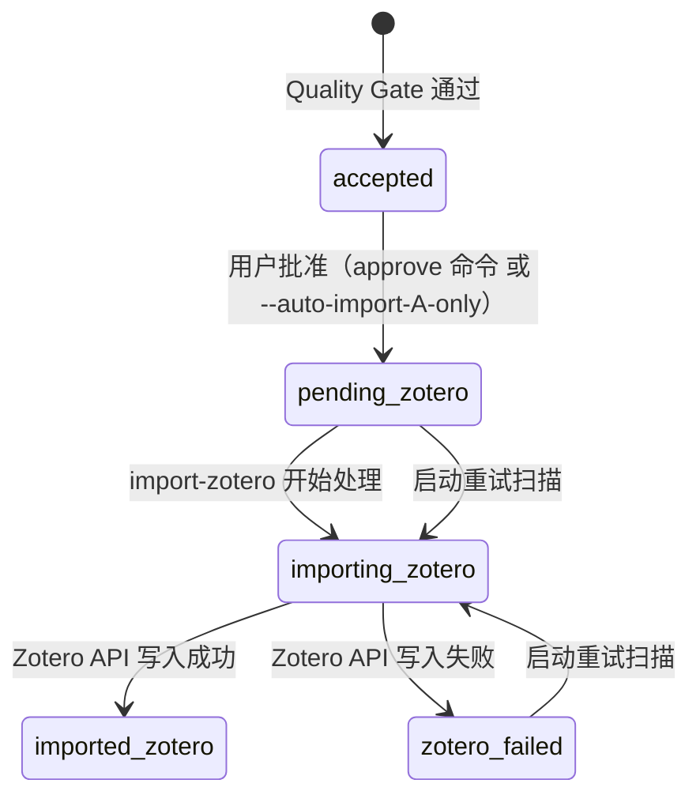

# ADR-003：Zotero Import State Machine

- **状态**：Accepted
- **日期**：2026-05-10
- **决策者**：项目设计阶段

> **实现阶段**：MVP3。本 ADR 为前向决策——MVP1/MVP2 不涉及 Zotero 写入，但 schema 和状态机设计在前期确定。

## 背景

Screening Agent 筛选出的论文需要导入 Zotero 文库。简单的"直接写入"方案存在风险：网络不稳定导致部分写入、人工审批缺失、重复导入等问题。需要一种可靠的状态管理机制。

## 决定

Zotero 写入采用**状态机**替代严格 two-phase commit。

### 状态图



### 状态定义

| 状态 | 含义 | 终态？ |
|---|---|---|
| `accepted` | Quality Gate 通过，等待人工批准 | ❌ |
| `pending_zotero` | 已批准，等待导入 | ❌ |
| `importing_zotero` | 正在通过 pyzotero 写入 | ❌ |
| `imported_zotero` | 导入成功 | ✅ |
| `zotero_failed` | 导入失败（可重试） | ❌ |

### 默认策略：manual_approval

`accepted` 状态的 paper **不会自动进入** `pending_zotero`。必须由用户通过以下方式之一批准：
- `approve` 命令（MVP5）
- `--auto-import-A-only` 显式标志（仅允许 priority=A 的论文自动转为 pending_zotero）

### import-zotero 命令行为

`import-zotero` 命令**默认只处理 `status='pending_zotero'` 的 items**。`accepted` 但未批准的论文不会被写入 Zotero。

可通过以下参数调整行为：
- `--include-accepted`：同时处理 `accepted` 状态的 items（仍保持 manual_approval）
- `--auto-import-A-only`：将 priority=A 且 status=accepted 的 items 自动转为 pending_zotero 并导入

### 重试机制

启动时扫描所有非终态（`pending_zotero` / `importing_zotero` / `zotero_failed`），自动重试。

### 幂等性

DOI 或 zotero_item_key **任一存在**则不创建新条目，改为更新已有条目。确保同一篇论文不会在 Zotero 中重复出现。

## 数据库变更

papers 表新增字段（MVP3 引入）：

```sql
ALTER TABLE papers ADD COLUMN zotero_state TEXT;
-- 取值：accepted / pending_zotero / importing_zotero / imported_zotero / zotero_failed
ALTER TABLE papers ADD COLUMN zotero_last_error TEXT;
```

## 后果

### 优点
- 状态可追踪：每次导入都有明确状态，便于监控和排查
- 支持人工审批：默认 manual_approval 防止错误论文入库
- 自动重试：非终态在启动时自动扫描重试，减少手动干预
- 幂等安全：重复运行不会产生重复条目

### 缺点
- MVP1/MVP2 期间 papers 表需预留 `zotero_state` 和 `zotero_last_error` 字段（或用 migration 在 MVP3 补加）
- 状态机增加了一定的代码复杂度
